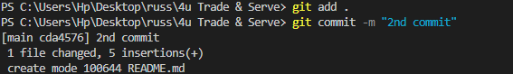

Name:- Muhammad Ammad Choudhary

Reg:- 4293-FBAS/BSSE/F-21(A)

This is a project that I made in my web engineering course.
It is a website for a business called '4U Trade & Serve'
Following is a snapshot of the project.

As you can see by the stats in the about panel of the repository, I have used html, css and javascript(for Animations)
in the project.

following are the screenshots of my commands that I used.

intialized a new git repository

used git add . command to add all the untracked files for the commit

It was giving me error as the author identity was unknown

so I added my email and username and my first commit

added my origin and pushed to my repo

made some changes, so had to do add and commit again

then after making another change, added then commited and pushed it to update on my repo

